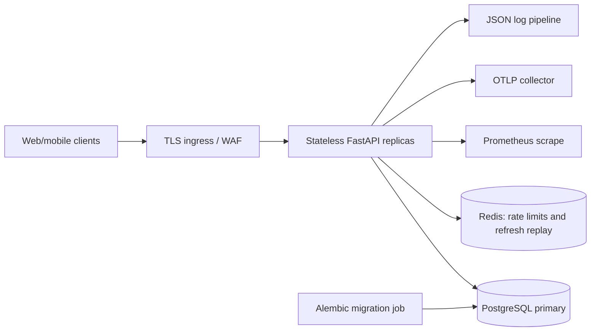
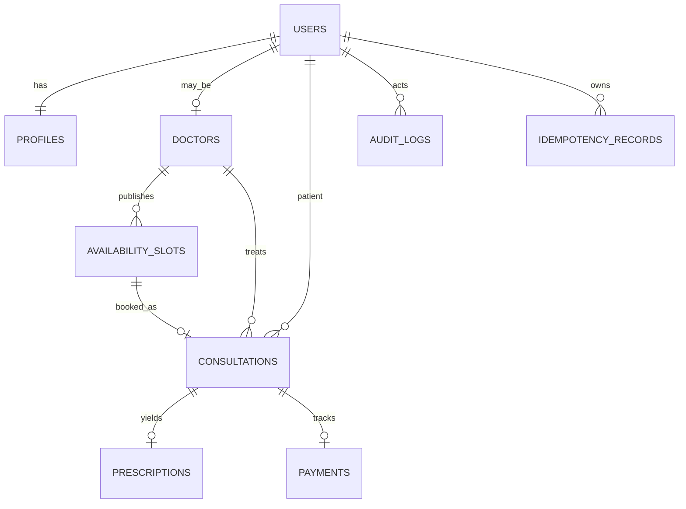

# Architecture and operating model

## Scope and targets

The service covers user lifecycle, role-based access, doctor availability, booking, consultation transitions, prescriptions, search, audit events, payment-state bookkeeping, and admin analytics. The design target is 100,000 consultations/day, p95 reads below 200 ms, p95 writes below 500 ms, and 99.95% availability. These are requirements to validate under production-like traffic, not measured results from this repository.

## System and data flow



Modules keep request validation and authorization in routes/dependencies; business transitions and booking coordination live in services; SQLAlchemy models carry database constraints. PostgreSQL is the source of truth. Redis has no medical records or booking authority. API replicas can scale horizontally behind a load balancer. Docker Compose is a reproducible local deployment, not a multi-AZ production deployment.

## Data model



UUID primary keys avoid sequence coordination across replicas. Foreign keys tie records to users, doctors, and consultations. Unique constraints protect email, license number, slot start, consultation slot, one prescription/payment per consultation, and actor/scope/idempotency key. The doctor slot exclusion constraint rejects overlapping time ranges even under concurrent writes. Indexes cover doctor specialty, open slots, consultation list filters, and audit lookups. Soft deletion keeps clinical references intact while disabling an account; legal erasure requires a separate reviewed process.

## Booking and transactions

```mermaid
sequenceDiagram
  participant P as Patient
  participant A as API
  participant DB as PostgreSQL
  P->>A: POST /consultations + Idempotency-Key
  A->>DB: Begin transaction; check actor/key
  A->>DB: SELECT slot FOR UPDATE
  DB-->>A: Locked future open slot
  A->>DB: Mark booked; insert consultation
  A->>DB: Insert idempotency and audit rows
  A->>DB: Commit
  A-->>P: 201 consultation
  Note over A,DB: Concurrent key/slot conflict resolves to replay or 409
```

The slot row lock serializes competing bookings at READ COMMITTED. The second transaction waits, then sees `is_booked` and returns 409. The unique consultation-slot constraint remains a safety net. Concurrent requests with the same actor/key are serialized by the unique idempotency index; after a duplicate-key error the API rolls back and reads the committed result. Same key/different payload gives 409. Idempotency records should be retained at least as long as client retry windows and audited before pruning. State updates lock the consultation; prescription creation locks it too. Database commits also include the related audit row. A cancellation retires the slot, so rescheduling creates a new slot and preserves history.

Payment rows model an internal lifecycle: pending → succeeded/failed and succeeded → refunded. Admin-only state changes are transactional and keyed. A production provider integration would verify signed webhooks, bind provider transaction IDs, and reconcile asynchronously. Notifications and provider calls must occur after commit, via an outbox/worker with bounded exponential backoff and jitter; this repository does not send notifications or collect money. Never retry a non-idempotent remote request without a provider idempotency key.

## Capacity, search, and partitioning

100,000 consultations/day averages about 1.16 writes/second, but peak traffic, reads, audit writes, and bursty booking are the real sizing inputs. A read-heavy doctor search uses bounded pages and a PostgreSQL trigram GIN index for substring specialty search. Open slot listings use a compound doctor/booked/start index. Consultation lists use owner/time and status/time indexes. SQLAlchemy pooling is configured per replica; production total pool sizes must fit PostgreSQL connection limits, potentially through PgBouncer. Avoid unbounded offsets at very deep pages by adding cursor pagination once actual usage warrants it.

Redis stores short-lived counters for login/registration rate limiting and used refresh-token IDs until token expiry. It does not cache availability: a stale open-slot cache would mislead patients. If Redis fails, authentication writes fail closed with 503; readiness also fails so traffic can be shifted. PostgreSQL loss likewise fails readiness. Add an independent read replica only when measured read load justifies it; booking and prescription reads that require current state remain on primary.

At 100k/day, consultations and audit logs grow rapidly. Start with the current indexed tables. Before hundreds of millions of rows, migrate audit logs to monthly `created_at` partitions, then consultations by month with an explicit global slot uniqueness strategy. Native partition uniqueness cannot enforce a slot ID alone unless the partition key is included; preserve a separate slot reservation table or global registry. Archive old partitions according to clinical retention policy. Test partition migration and query plans before rollout.

## Observability and reliability

The middleware emits JSON logs containing timestamp, level, request ID, service, and error context. It never records request bodies, passwords, tokens, or prescription text. Prometheus records requests by route/method/status, latency histograms, and booking failures. Optional OTLP instruments FastAPI and SQLAlchemy. An ingress should collect p95 read/write histograms by route, error rate, DB saturation, lock waits, Redis failures, and replication lag. Set alerts for SLO burn, readiness, and backup failures. Protect `/metrics` at the network layer.

Retries belong at clients for 429/503 or network timeout, with exponential backoff, jitter, and a cap; booking/payment retry requests must retain the original idempotency key. The API does not blindly retry failed transactions. Database serialization/deadlock errors may be retried only by a bounded wrapper around the entire transaction with the same key, after a measured need emerges.

## Deployment, backup, and recovery

Production rollout should run Alembic once as a release job, then roll stateless API replicas behind TLS with readiness probes, minimum two availability zones, and a surge capacity policy. Secrets come from a secret manager rather than image layers. Use managed PostgreSQL with daily full backups, continuous WAL archiving and point-in-time recovery, encrypted backup copies in a second region, and a 30-day operational retention window (adjust for legal/clinical policy). Suggested objectives: RPO 15 minutes and RTO 4 hours; verify with quarterly restore drills. For logical corruption, stop writers, select a clean recovery point, restore to a new cluster, validate counts and critical bookings, then switch traffic. For zone loss, fail over to a healthy replica; for region loss, restore the cross-region copy and replay WAL. Redis may be rebuilt, but outstanding refresh replay state is lost, so rotate token versions or force reauthentication after total Redis loss.

## Trade-offs

One service and one primary database keep transactions and the 4–5 day implementation understandable. No distributed saga, payment processor, or notification worker is included because no external service is actually connected. MFA is TOTP rather than SMS. Encryption at rest for the database, backups, and network links belongs to deployment configuration; application-level Fernet protects MFA seeds. Scaling and latency targets need load tests, production metrics, and capacity tuning before being claimed.
